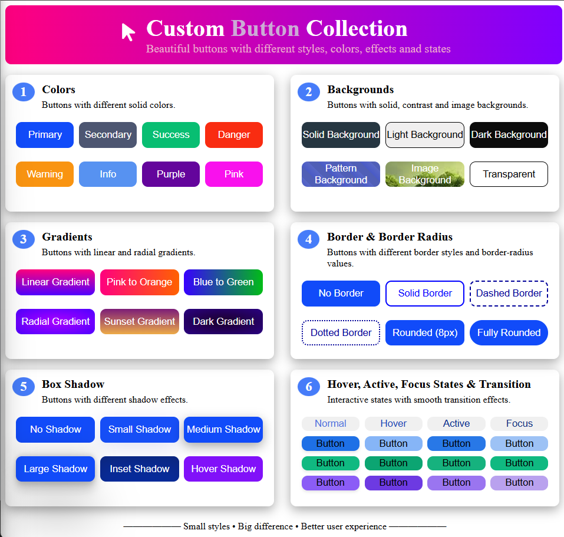

# 🎨 Custom Button Collection

A beautiful **Custom Button Collection** built using HTML5 and CSS3.

This project demonstrates different button styles, colors, backgrounds, gradients, borders, border-radius, box shadows, hover effects, active states, focus states, and CSS transitions.

The main goal of this project is to practice and understand how different CSS properties can be combined to create attractive and interactive buttons.

---

## 📌 Description

The **Custom Button Collection** contains multiple sections showcasing different button designs and CSS effects.

The project includes:

1. 🎨 Different Button Colors
2. 🖼️ Different Background Styles
3. 🌈 Linear and Radial Gradients
4. 🔲 Border and Border Radius Styles
5. 🌑 Different Box Shadow Effects
6. 🖱️ Hover, Active, Focus States and Transitions

Each section contains multiple buttons demonstrating different CSS techniques.

---

## ✨ Features

- 🎨 Multiple solid button colors
- 🖼️ Solid background
- ☀️ Light background
- 🌑 Dark background
- 🔷 Pattern background
- 🏞️ Image background
- 🪟 Transparent background
- 🌈 Linear gradients
- 🎨 Radial gradients
- 🌅 Sunset gradient
- 🔲 Solid borders
- ➖ Dashed borders
- ⋯ Dotted borders
- 🔵 Rounded buttons
- ⚪ Fully rounded buttons
- 🌑 Small box shadow
- 🌑 Medium box shadow
- 🌑 Large box shadow
- 🔳 Inset shadow
- ✨ Hover shadow
- 🖱️ Hover state
- 👆 Active state
- 🎯 Focus state
- ⚡ CSS transitions
- 🔄 Transform effects
- ⭐ Font Awesome icon

---

## 🧠 CSS Concepts Used

### 1. CSS Reset

The universal selector is used to reset default browser spacing and apply `box-sizing`.

```css
* {
  box-sizing: border-box;
  margin: 0;
  padding: 0;
}
```

---

### 2. CSS Grid

CSS Grid is used to arrange the button sections and buttons in different columns.

```css
#boxes {
  display: grid;
  grid-template-columns: 1fr 1fr;
  gap: 15px;
}
```

Different button layouts are also created using Grid.

```css
.btn4 {
  grid-template-columns: 1fr 1fr 1fr 1fr;
}

.btn3 {
  grid-template-columns: 1fr 1fr 1fr;
}
```

---

### 3. Flexbox

Flexbox is used to align the header content and footer.

```css
#header {
  display: flex;
  justify-content: center;
  align-items: center;
}
```

---

### 4. Background Colors

Different buttons use different background colors.

```css
.box11 {
  background-color: #114bf9;
}

.box13 {
  background-color: #08be72;
}

.box14 {
  background-color: #f92c11;
}
```

---

### 5. Background Images

An image is used as a button background.

```css
.box25 {
  background-image: url(img.jpg);
}
```

---

### 6. Linear Gradient

Linear gradients create smooth color transitions.

```css
.box31 {
  background: linear-gradient(#ff007f, #4f00ff);
}
```

Another example:

```css
.box32 {
  background: linear-gradient(to right, #ff007f, #ff6200);
}
```

---

### 7. Radial Gradient

Radial gradients create colors spreading from a central point.

```css
.box34 {
  background: radial-gradient(#aa00ff, #4f00ff);
}
```

---

### 8. Repeating Linear Gradient

A repeating gradient is used to create a pattern background.

```css
.box24 {
  background: repeating-linear-gradient(
    45deg,
    #495ac7,
    #5968c5 10px,
    #505fb8 10px,
    #505fb5 20px
  );
}
```

---

### 9. Border

Different border styles are demonstrated.

#### Solid Border

```css
.box42 {
  border: 2px solid blue;
}
```

#### Dashed Border

```css
.box43 {
  border: 2px dashed;
}
```

#### Dotted Border

```css
.box44 {
  border: 2px dotted;
}
```

---

### 10. Border Radius

`border-radius` is used to create rounded corners.

```css
.box45 {
  border-radius: 8px;
}
```

A larger value creates a more rounded button.

```css
.box46 {
  border-radius: 17px;
}
```

---

### 11. Box Shadow

Different shadow effects are demonstrated in the project.

```css
.box53 {
  box-shadow: rgba(0, 0, 0, 0.35) 0px 5px 15px;
}
```

The project also includes:

- No Shadow
- Small Shadow
- Medium Shadow
- Large Shadow
- Inset Shadow
- Hover Shadow

---

### 12. Inset Box Shadow

The `inset` keyword creates an inner shadow.

```css
.box55 {
  box-shadow:
    rgba(50, 50, 93, 0.25) 0px 30px 60px -12px inset,
    rgba(0, 0, 0, 0.3) 0px 18px 36px -18px inset;
}
```

---

### 13. Hover State

The `:hover` pseudo-class changes the button appearance when the mouse pointer moves over it.

```css
.box56:hover {
  box-shadow:
    rgba(0, 0, 0, 0.17) 0px -23px 25px 0px inset;
}
```

Another example:

```css
.box66:hover {
  background-color: #3b82f6;
  transform: translateY(-2px);
}
```

---

### 14. Active State

The `:active` pseudo-class applies styles while the button is being clicked.

```css
.box67:active {
  background-color: #1d4ed8;
  box-shadow: inset 0 3px 6px rgba(0, 0, 0, 0.25);
}
```

---

### 15. Focus State

The `:focus` pseudo-class styles an element when it receives keyboard or mouse focus.

```css
.box68:focus {
  background-color: #1e70e6;
  border-color: #ffffff;
  box-shadow: 0 0 0 3px #93c5fd;
}
```

---

### 16. CSS Transition

Transitions make state changes smooth instead of instant.

```css
transition:
  background-color 0.25s ease,
  box-shadow 0.25s ease,
  transform 0.25s ease,
  border-color 0.25s ease;
```

---

### 17. Transform

The `transform` property is used to slightly move buttons during hover.

```css
transform: translateY(-2px);
```

This creates a small lift effect.

---

### 18. CSS Attribute Selector

An attribute selector is used to target classes beginning with `box6`.

```css
[class^="box6"] {
  border-radius: 8px;
  border: 2px solid transparent;
  transition:
    background-color 0.25s ease,
    box-shadow 0.25s ease,
    transform 0.25s ease,
    border-color 0.25s ease;
}
```

The `^=` operator means the attribute value **starts with** the specified text.

---

### 19. Font Awesome

Font Awesome is used for the pointer icon in the header.

```html
<i class="fa-solid fa-arrow-pointer"></i>
```

The Font Awesome stylesheet is imported using a CDN.

---

## 🎨 Button Categories

### 1️⃣ Colors

Buttons with different solid colors:

- Primary
- Secondary
- Success
- Danger
- Warning
- Info
- Purple
- Pink

---

### 2️⃣ Backgrounds

Different background styles:

- Solid Background
- Light Background
- Dark Background
- Pattern Background
- Image Background
- Transparent

---

### 3️⃣ Gradients

Different gradient styles:

- Linear Gradient
- Pink to Orange
- Blue to Green
- Radial Gradient
- Sunset Gradient
- Dark Gradient

---

### 4️⃣ Border & Border Radius

Different border styles:

- No Border
- Solid Border
- Dashed Border
- Dotted Border
- Rounded
- Fully Rounded

---

### 5️⃣ Box Shadow

Different shadow effects:

- No Shadow
- Small Shadow
- Medium Shadow
- Large Shadow
- Inset Shadow
- Hover Shadow

---

### 6️⃣ Interactive States

The project demonstrates:

- Normal state
- Hover state
- Active state
- Focus state
- Transition effects
- Transform effects

---

## 🏗️ HTML Structure

The project uses semantic and structural HTML elements such as:

- `<header>`
- `<main>`
- `<div>`
- `<h1>`
- `<h3>`
- `<h4>`
- `<p>`
- `<button>`
- `<footer>`

The buttons are organized into separate sections based on their styling concepts.

---

## 📂 Project Structure

```text
Custom-Button-Collection/
│
├── index.html
├── style.css
├── img.jpg
└── README.md
```

---

## 🛠️ Technologies Used

- HTML5
- CSS3
- CSS Grid
- CSS Flexbox
- CSS Gradients
- CSS Box Shadow
- CSS Pseudo-classes
- CSS Transitions
- CSS Transform
- CSS Selectors
- Font Awesome
- Git
- GitHub

---

## 🔗 External Resource

Font Awesome is used for the pointer icon.

```html
<link
  rel="stylesheet"
  href="https://cdnjs.cloudflare.com/ajax/libs/font-awesome/7.3.1/css/all.css"
>
```

---

## ▶️ How to Run

1. Download or clone the repository.

2. Open the project folder in VS Code.

3. Make sure the following files are present:

```text
index.html
style.css
img.jpg
```

4. Open `index.html` in your browser.

5. Move your mouse over the buttons and click them to see different interactive states.

That's it! 🚀

---

## 📸 Preview

Add your project screenshot here:



---

## 🎯 Learning Purpose

The main purpose of this project is to practice **CSS button styling and interactive states**.

Through this project, I practiced:

- CSS Colors
- Backgrounds
- Background Images
- Linear Gradients
- Radial Gradients
- Repeating Gradients
- Borders
- Border Radius
- Box Shadow
- Inset Shadow
- Hover
- Active
- Focus
- Transition
- Transform
- CSS Grid
- Flexbox
- Attribute Selectors
- Pseudo-classes
- Font Awesome
- Button styling

---

## 🚀 Future Improvements

In the future, this project can be improved by adding:

- 📱 Fully responsive design
- 🌙 Dark mode
- ✨ More button animations
- 🎭 Glassmorphism buttons
- 💎 Neumorphism buttons
- ⚡ Loading buttons
- ⏳ Disabled buttons
- 🔄 Animated buttons
- 🎨 More gradient combinations
- 🖱️ Ripple effects
- 📋 Copy CSS button functionality
- 🧩 Button component categories
- 📱 Mobile-friendly layouts

---

## 👨‍💻 Author

**Abdul Azeem**

Aspiring Java Full Stack Developer 🚀

**GitHub:** [Abdul Azeem](https://github.com/abdulazeem8630)

**LinkedIn:** [Abdul Azeem](https://www.linkedin.com/in/abdul-azeem-0780783a8/)

---

⭐ If you like this project, consider giving it a star on GitHub!