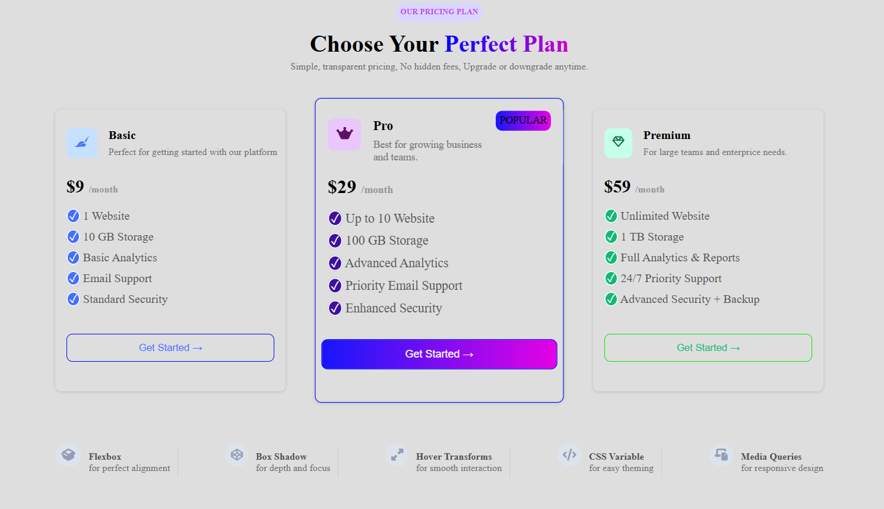

# 💳 Responsive Pricing Cards

A modern and responsive **Pricing Cards UI** built using **HTML and CSS**.

This project contains three pricing plans — **Basic, Pro, and Premium** — with different features and pricing. The **Pro plan** is highlighted as the most popular option.

The main focus of this project is practicing **Flexbox, Box Shadow, Hover Transforms, CSS Variables concepts, gradients, responsive design, and Media Queries**.

---

## 📌 Features

- 💰 Three pricing plans
  - Basic
  - Pro
  - Premium
- ⭐ Highlighted "Popular" Pro plan
- 📱 Responsive layout
- 🎨 Gradient text and backgrounds
- 🪄 Hover and transform effects
- 🌑 Box shadows for depth
- 📦 Flexbox-based layout
- 📐 Responsive Media Queries
- 🎯 Different colors for each pricing plan
- 🔘 Styled CTA buttons
- 🔹 Font Awesome icons
- 📱 Mobile-friendly design

---

## 💳 Pricing Plans

### 🟦 Basic — $9/month

- 1 Website
- 10 GB Storage
- Basic Analytics
- Email Support
- Standard Security

### 🟪 Pro — $29/month

**POPULAR**

- Up to 10 Websites
- 100 GB Storage
- Advanced Analytics
- Priority Email Support
- Enhanced Security

### 🟩 Premium — $59/month

- Unlimited Websites
- 1 TB Storage
- Full Analytics & Reports
- 24/7 Priority Support
- Advanced Security + Backup

---

## 🎯 HTML Concepts Used

This project uses the following HTML concepts:

- HTML5 document structure
- Semantic elements
- `<header>`
- `<main>`
- `<footer>`
- `<div>`
- `<h1>`, `<h2>`, `<h4>`
- `<p>`
- `<span>`
- `<button>`
- `<i>`
- Classes
- Font Awesome icons
- External CSS stylesheet

---

## 🎨 CSS Concepts Used

### 1. CSS Reset

```css
* {
    margin: 0;
    padding: 0;
    box-sizing: border-box;
}
```

Used to reset default browser spacing and control element sizing.

---

### 2. Flexbox

Flexbox is used for:

- Header alignment
- Pricing card layout
- Card content alignment
- Footer feature alignment

Example:

```css
.container {
    display: flex;
    justify-content: space-between;
}
```

---

### 3. Box Shadow

Cards use `box-shadow` to create depth and separation from the background.

```css
.box {
    box-shadow: rgba(0, 0, 0, 0.16) 0px 1px 4px;
}
```

---

### 4. Transform

The Pro card is slightly enlarged to make it stand out.

```css
.box2 {
    transform: scale(1.08);
}
```

---

### 5. Gradients

Linear gradients are used for:

- Heading text
- Popular badge
- Pro button
- Visual styling

Example:

```css
background: linear-gradient(to right, blue, rgb(204, 1, 204));
```

---

### 6. Border Radius

Rounded corners are created using:

```css
border-radius: 8px;
```

---

### 7. Responsive Design

Media queries are used to adjust the layout for different screen sizes.

The project contains responsive breakpoints for:

- Tablets
- Laptops
- Desktops
- Large screens

Example:

```css
@media screen and (min-width: 577px) and (max-width: 768px) {
    ...
}
```

---

### 8. Background Colors

Different background colors are used to visually distinguish the pricing plans and icons.

---

### 9. Button Styling

Pricing buttons are customized using:

- Padding
- Border
- Border-radius
- Colors
- Gradients
- Transparent backgrounds

---

### 10. Font Awesome Icons

Font Awesome is used for pricing plan and footer icons.

Examples:

- Basic plan icon
- Pro plan icon
- Premium plan icon
- Flexbox icon
- Box Shadow icon
- Responsive design icon

---

## 🏗️ Project Structure

```text
Responsive-Pricing-Cards/
│
├── index.html
├── style.css
├── img.png
└── README.md
```

---

## 🛠️ Technologies Used

- HTML5
- CSS3
- Flexbox
- CSS Media Queries
- CSS Gradients
- CSS Box Shadow
- CSS Transform
- Font Awesome

---

## 📱 Responsive Design

The pricing cards are designed to adapt to different screen sizes.

### Tablet

The layout and typography are adjusted for tablet-sized screens.

### Laptop

The content width is reduced to maintain a clean layout.

### Desktop

The pricing section uses a wider layout with three cards.

### Large Screens

The main content is given a controlled width and centered on the page.

---

## 🎨 UI Structure

```text
                OUR PRICING PLAN

          Choose Your Perfect Plan
       Simple, transparent pricing...


    ┌─────────────┐  ┌─────────────┐  ┌─────────────┐
    │    BASIC    │  │     PRO     │  │  PREMIUM    │
    │             │  │  POPULAR ⭐ │  │             │
    │  $9/month   │  │ $29/month   │  │ $59/month   │
    │             │  │             │  │             │
    │  Features   │  │  Features   │  │  Features   │
    │             │  │             │  │             │
    │ Get Started │  │ Get Started │  │ Get Started │
    └─────────────┘  └─────────────┘  └─────────────┘


             Flexbox | Box Shadow | Hover
          CSS Variables | Media Queries
```

---

## ▶️ How to Run

1. Clone or download the repository.

2. Open the project folder.

3. Open `index.html` in your browser.

4. Resize the browser window to test the responsive design.

You can also use the **Live Server** extension in VS Code.

---

## 🖼️ Preview



---

## 📚 What I Learned

Through this project, I practiced:

- Creating pricing card layouts
- Using Flexbox for alignment
- Creating visually attractive UI cards
- Using gradients in CSS
- Applying box shadows
- Using CSS transforms
- Styling buttons
- Working with Font Awesome icons
- Creating responsive layouts
- Using Media Queries
- Managing different screen sizes
- Creating a highlighted/popular pricing card

---

## 🚀 Future Improvements

- Add hover animations to all pricing cards
- Add monthly/yearly pricing toggle
- Add JavaScript functionality
- Add dark/light mode
- Add more pricing plans
- Add feature comparison
- Improve mobile layout further
- Add accessibility improvements

---

## 👨‍💻 Author

**Abdul Azeem**  
Aspiring Java Full Stack Developer

- GitHub: https://github.com/abdulazeem8630
- LinkedIn: https://www.linkedin.com/in/abdul-azeem-0780783a8/

---

⭐ If you like this project, consider giving the repository a star!