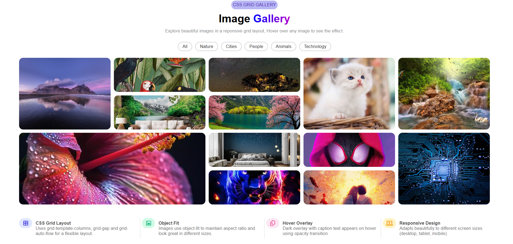

# 🖼️ Image Gallery with CSS Grid

A modern and responsive **Image Gallery** built using **HTML and CSS Grid**.

This project displays a collection of images in a structured grid layout with different image sizes. Users can hover over images to see a smooth **image zoom and dark overlay effect with captions**.

The main focus of this project is practicing **CSS Grid, Grid Spanning, Object Fit, Hover Effects, CSS Transitions, Overlay Effects, and Responsive Design**.

---

## 📌 Features

- 🖼️ Modern image gallery layout
- 🔲 CSS Grid based design
- 📐 Different image sizes using grid spanning
- 🔍 Image zoom effect on hover
- 🌑 Dark caption overlay on hover
- ✨ Smooth CSS transitions
- 🏷️ Image category navigation
- 📱 Responsive-friendly structure
- 🎨 Gradient heading text
- 🔘 Styled category buttons
- 🎯 Different image categories
- 🔹 Font Awesome icons

---

## 🖼️ Image Categories

The gallery contains images related to different categories:

- 🌿 Nature
- 🏙️ Cities
- 👨 People
- 🐱 Animals
- 💻 Technology

The category navigation is created using anchor links.

---

## 🎯 HTML Concepts Used

This project uses the following HTML concepts:

- HTML5 document structure
- Semantic elements
- `<header>`
- `<main>`
- `<footer>`
- `<div>`
- ``
- `<h1>`
- `<h3>`
- `<h4>`
- `<p>`
- `<span>`
- `<a>`
- `<i>`
- Classes
- `alt` attributes for images
- External CSS stylesheet
- Font Awesome icons

---

## 🎨 CSS Concepts Used

### 1. CSS Grid

The main gallery is created using CSS Grid.

```css
.container {
    display: grid;
    grid-template-columns: repeat(5, 1fr);
    gap: 10px;
}
```

This creates a flexible five-column gallery layout.

---

### 2. Grid Column & Row Spanning

Different images occupy different amounts of space using:

```css
grid-column: span 2;
grid-row: span 2;
```

This creates a visually interesting masonry-style grid.

---

### 3. Grid Auto Flow

The project uses:

```css
grid-auto-flow: dense;
```

This allows the browser to fill available grid spaces more efficiently.

---

### 4. Grid Auto Rows

The gallery uses:

```css
grid-auto-rows: 100px;
```

This defines the automatic row size of the grid.

---

### 5. Object Fit

Images use:

```css
object-fit: cover;
```

This ensures that images fill their containers while maintaining their aspect ratio.

---

### 6. Hover Image Zoom

When the user hovers over an image, it smoothly zooms in.

```css
.box:hover img {
    transform: scale(1.08);
}
```

---

### 7. Overlay Effect

Each image has an overlay containing its title and description.

The overlay is initially hidden using:

```css
opacity: 0;
```

When the image is hovered:

```css
.box:hover .overlay {
    opacity: 1;
}
```

---

### 8. CSS Transitions

Smooth transitions are applied to image zoom and overlay effects.

```css
transition: opacity 0.4s ease;
```

---

### 9. Positioning

The image overlay uses:

- `position: absolute`
- `left`
- `right`
- `bottom`

The image box uses:

```css
position: relative;
```

This allows the overlay to be positioned relative to the image container.

---

### 10. Gradient Text

The main heading uses a gradient effect.

```css
background: linear-gradient(to right, blue, rgb(180, 1, 204));
background-clip: text;
-webkit-text-fill-color: transparent;
```

---

### 11. Flexbox

Flexbox is used for:

- Header alignment
- Category navigation
- Footer information
- Icon and text alignment

Example:

```css
.type {
    display: flex;
    justify-content: space-between;
}
```

---

### 12. Hover & Focus States

Category links include interactive states.

```css
a:hover {
    transform: scale(1.02);
}

a:focus {
    background-color: rgb(68, 68, 251);
}
```

---

### 13. Border Radius

Rounded corners are applied to:

- Category buttons
- Gallery images
- Image containers
- Footer icons

---

### 14. Responsive Design

The layout is designed with responsive behavior in mind so that the gallery can adapt to different screen sizes.

---

## 🏗️ Gallery Structure

```text
                    CSS GRID GALLERY

                 Image Gallery
        Explore beautiful images...

       All | Nature | Cities | People | Animals | Technology


    ┌─────┬─────┬─────┬─────┬─────┐
    │     │     │     │     │     │
    │  1  │  2  │  3  │  4  │  5  │
    │     │     │     │     │     │
    ├─────┼─────┼─────┼─────┼─────┤
    │     │     │     │           │
    │  6  │  7  │  8     │   9    │
    │     │     │           │      │
    ├─────┼─────┼─────┤           │
    │ 10  │ 11  │ 12  │     13    │
    └─────┴─────┴─────┴───────────┘
```

Different grid spans are used to create variation in image sizes.

---

## ✨ Image Hover Effect

Each gallery image provides an interactive hover experience.

When the user moves the mouse over an image:

1. The image slightly zooms in.
2. A dark overlay appears.
3. Image title becomes visible.
4. Image description becomes visible.
5. The transition happens smoothly.

---

## 📁 Project Structure

```text
Image-Gallery/
│
├── index.html
├── style.css
├── img1.avif
├── img2.jpg
├── img3.jpg
├── img4.jpg
├── img5.jpg
├── img6.webp
├── img7.jpg
├── img8.jpg
├── img9.webp
├── img10.jpg
├── img11.jpg
├── img12.webp
├── img13.jpg
├── img.png
└── README.md
```

---

## 🛠️ Technologies Used

- HTML5
- CSS3
- CSS Grid
- Flexbox
- CSS Transitions
- CSS Transform
- CSS Positioning
- Object Fit
- CSS Gradients
- Hover Effects
- Focus States
- Font Awesome

---

## 🔹 CSS Grid Concepts Practiced

This project focuses heavily on CSS Grid concepts such as:

- `display: grid`
- `grid-template-columns`
- `grid-auto-flow`
- `grid-auto-rows`
- `grid-column`
- `grid-row`
- `span`
- `gap`
- Fractional units (`fr`)

---

## ▶️ How to Run

1. Clone or download the repository.

2. Open the project folder in VS Code.

3. Make sure all image files are present in the project folder.

4. Open `index.html` in your browser.

5. Hover over different images to see the zoom and overlay effects.

You can also use the **Live Server** extension in VS Code.

---

## 🖼️ Preview



---

## 📚 What I Learned

Through this project, I practiced:

- Creating an image gallery using CSS Grid
- Creating multi-sized grid items
- Using `grid-column` and `grid-row`
- Understanding `span`
- Using `grid-auto-flow: dense`
- Working with `grid-auto-rows`
- Using `object-fit: cover`
- Creating image hover zoom effects
- Creating dark image overlays
- Using opacity transitions
- Using CSS positioning
- Creating gradient text
- Using Flexbox for alignment
- Creating hover and focus states
- Using Font Awesome icons
- Building a visually appealing gallery layout

---

## 🚀 Future Improvements

- Add more image categories
- Add JavaScript-based category filtering
- Add lightbox image preview
- Add next/previous image navigation
- Add CSS animations
- Improve mobile layout
- Add lazy loading for images
- Add accessibility improvements
- Add search functionality

---

## 👨‍💻 Author

**Abdul Azeem**  
Aspiring Java Full Stack Developer

- GitHub: https://github.com/abdulazeem8630
- LinkedIn: https://www.linkedin.com/in/abdul-azeem-0780783a8/

---

⭐ If you like this project, consider giving the repository a star!